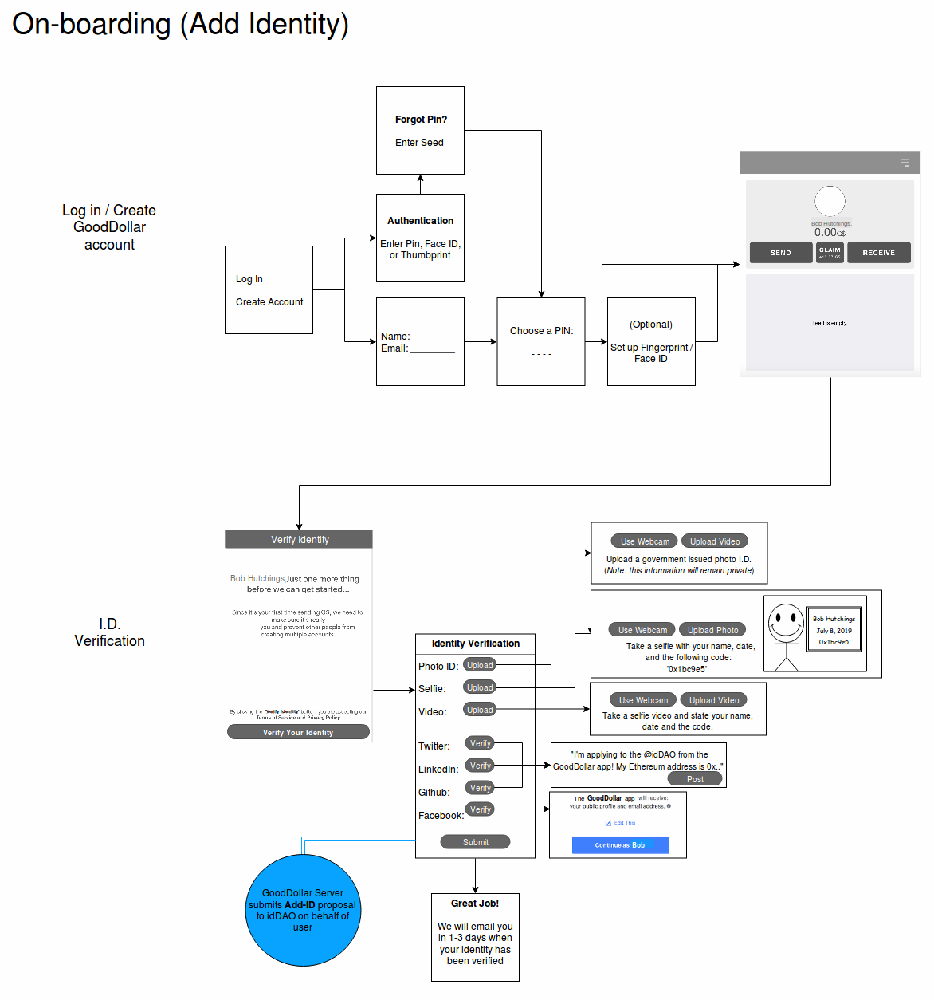

# IdentityDAO 

## Add Identity

### GoodDollar User Onboarding



After the user goes through GoodDollar's login in / create account flow, they'll be asked to verify their identity. The user will be asked to provide a selfie, video, and social account verifications. These will all be verified by the DAO through a proposal accessible through alchemy.

Example Proposal Payload:
```json
{
  "name" : "Ori Shimony",
  "address" : "0x6230204B1714C691804D1c71F325FDb0e184339Q", 
  "media": {
    "selfie" : "ipfs://ijnyttg6th7y7f5g",
    "video" : "ipfs://NUAh08hniaksm,laks",
  },
  "social" : {
    "Twitter" : "https://twitter.com/dOrg_tech/status/1110270197665951744",
    "LinkedIn" : "...",
    "Github" : "...",
  },
  "oracles" : [
    "GoodDollar",
    "Keybase",
  ]
}
```

Example Oracle Query:
```json
Oracle:
"GoodDollar" => "https://verify.gooddollar.org/0x6230204B1714C691804D1c71F325FDb0e184339Q"
returns:
{
  "facebook-oauth" : true,
  "google-oauth" : true,
  "gov-id-verified" : true
}
```

### Alchemy Identity Verification


In Alchemy, the proposal payload that was prepared in the GoodDollar app is shown in the UI. Any verifications from the GoodDollar's oracle is queried by Alchemy and populated. With this information, human voters can check these to determine whether the proposal is real. 

### Scenario Flowchart


### Exception Scenarios

Some of the scenarios below may be encountered along the above process and have been briefly fleshed out below. These include a user with a current account already existing on the GoodDollar server attempting to re-register, and a user that has submitted a proposal, but has had it rejected by the DAO.


## Update Identity

### GoodDollar User Update Process


Users will also be able to update their identity if necessary; for example, a new Twitter handle, a new personal address, or any other identifying information that may change over time may need an update at some point.

In order to make sure this information is kept up to date, users will be required to update their identity every 2 years and undergo the identity verification steps again.

### Alchemy Edit Verification

On Alchemy, any changes or edits to a pre-existing identity will be reflected by the UI. Anything that has stayed the same will be omitted.


### Scenario Flowchart


### Exception Scenarios

A rejected proposal to edit a user's information by the DAO is treated much like a rejected proposal to add a user, and is reflected in a very similar way user-side.


## Remove Identity

### GoodDollar User Off-boarding

Removing an identity from the GoodDollar app is fairly straightforward. Within the GoodDollar app's menu bar, the user would simply tap "Delete Account", and confirm the deletion. Finally, the GoodDollar server relays the signed transaction to remove the account to the network, and an email is sent to the user on success.


### Scenario Flowchart


## Miscellaneous Scenarios

Any scenarios below are flows which either do not specifically pertain to any of the three main scenarios (adding, editing, removing an identity) or are interchangeable "sub-flows" referenced by the main flows.

The first two are interchangeable "sub-flows", whereas the last one, *Deletion of GoodDollar User's Identity from DAO*, reflects a case where a suspicious user from the DAO raises a proposal to remove the identity from the registry and succeeds. They can choose to either start the process again, or contact support.

### User Forgot PIN


### Contact Support


### Deletion of GoodDollar User's Identity from DAO


