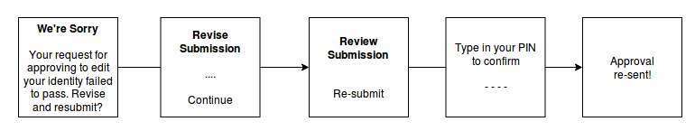
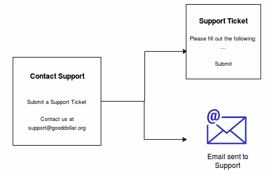

# IdentityDAO 

## Add I.D.

### GoodDollar User On-boarding


After the user goes through GoodDollar's login in / create account flow, they'll be asked to verify their identity. The user will be asked to provide a selfie, video, and social account verifications. These will all be verified by the DAO through a proposal accessible through alchemy.

*Example Proposal Payload:*
```json
{
  "name" : "Bob Hutchings",
  "address" : "0x1bc9e52baa93dab1a47c3168fd82ed08856ec83", 
  "media": {
    "selfie" : "ipfs://QmSrPmbaUKA3ZodhzPWZnpFgcPMFWF4QsxXbkWfEptTBJd",
    "video" : "ipfs://WeStGmTvKOZ3ZfdacKASnpFcsCFGGV1WxcCvnLzBmvVCNq",
  },
  "social" : {
    "Twitter" : "https://twitter.com/Hutchin_Bunchin/status/1110270197665951744",
    "LinkedIn" : "...",
    "Github" : "...",
  },
  "oracles" : [
    "GoodDollar",
    "Keybase",
  ]
}
```

*Example Oracle Query:*
```json
Oracle:
"GoodDollar" => "https://verify.gooddollar.org/0x1bc9e52baa93dab1a47c3168fd82ed08856ec83"
returns:
{
  "facebook-oauth" : true,
  "google-oauth" : true,
  "gov-id-verified" : true
}
```

### Alchemy Add I.D. Verification


In Alchemy, the proposal payload that was prepared in the GoodDollar app is shown in the UI. Any verifications from GoodDollar's oracle are queried by Alchemy and shown. Two primary use cases for this oracle are government ID verification and external account OAuths. With this information, human voters can check these to determine whether the proposal is real. 

### Scenario Flowchart


### Exception Scenarios

Some of the scenarios below may be encountered along the above process and have been briefly fleshed out below. These include a user with a current account already existing on the GoodDollar server attempting to re-register, and a user that has submitted a proposal, but has had it rejected by the DAO.


## Edit I.D.

### GoodDollar User Profile Update


### Alchemy Edit I.D. Verification


On Alchemy, any changes or edits to a pre-existing identity will be reflected by the UI. Anything that has stayed the same will be omitted.

### Scenario Flowchart


### Exception Scenarios

A rejected proposal to edit a user's information by the DAO is treated much like a rejected proposal to add a user, and is reflected in a very similar way user-side.



## Delete I.D.

### GoodDollar User Off-boarding


Deleting an identity from the GoodDollar app is fairly straightforward. Within the GoodDollar app's menu bar, the user would simply tap "Delete Account", and confirm the deletion. Finally, the GoodDollar server relays the signed transaction to remove the account to the network, and an email is sent to the user on success.

### Scenario Flowchart


## Miscellaneous Scenarios

### User Forgot PIN


### Contact Support



### DAO Removes GoodDollar User's Identity


