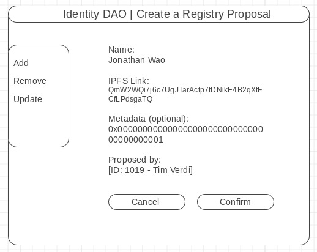
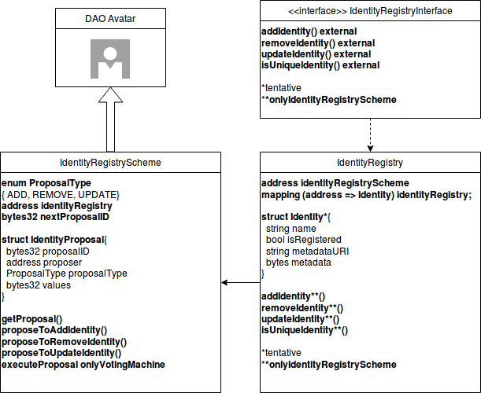
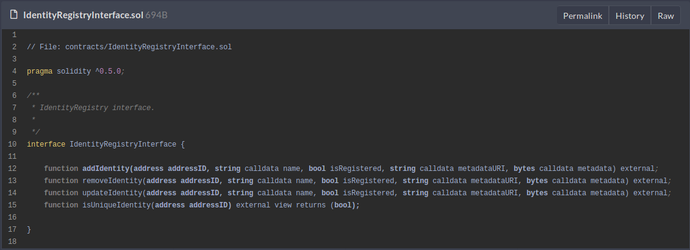
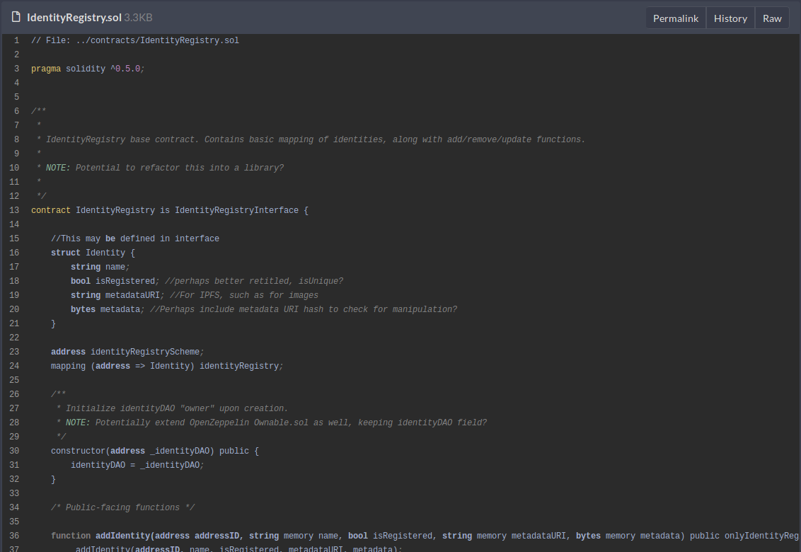
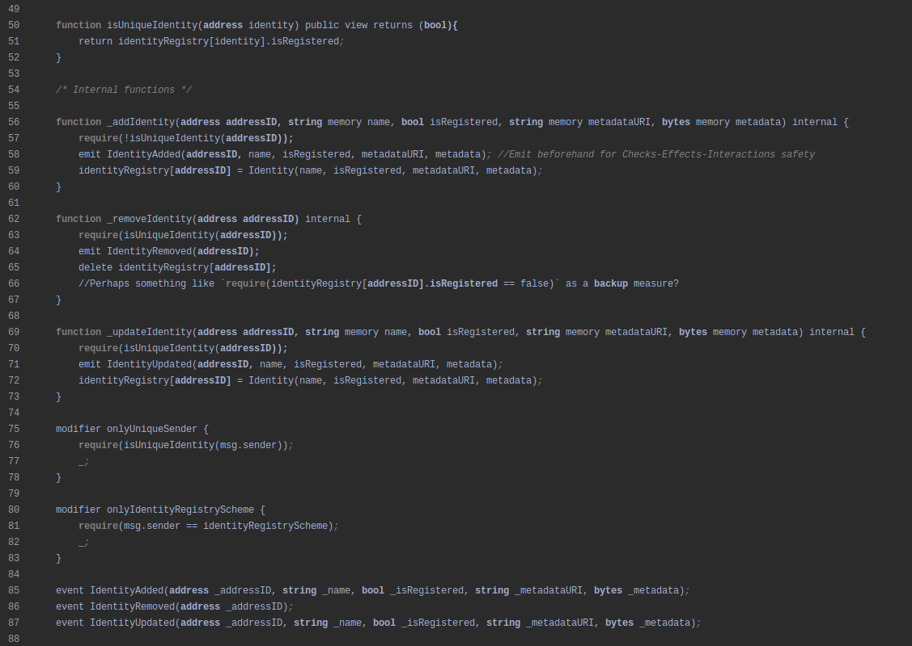
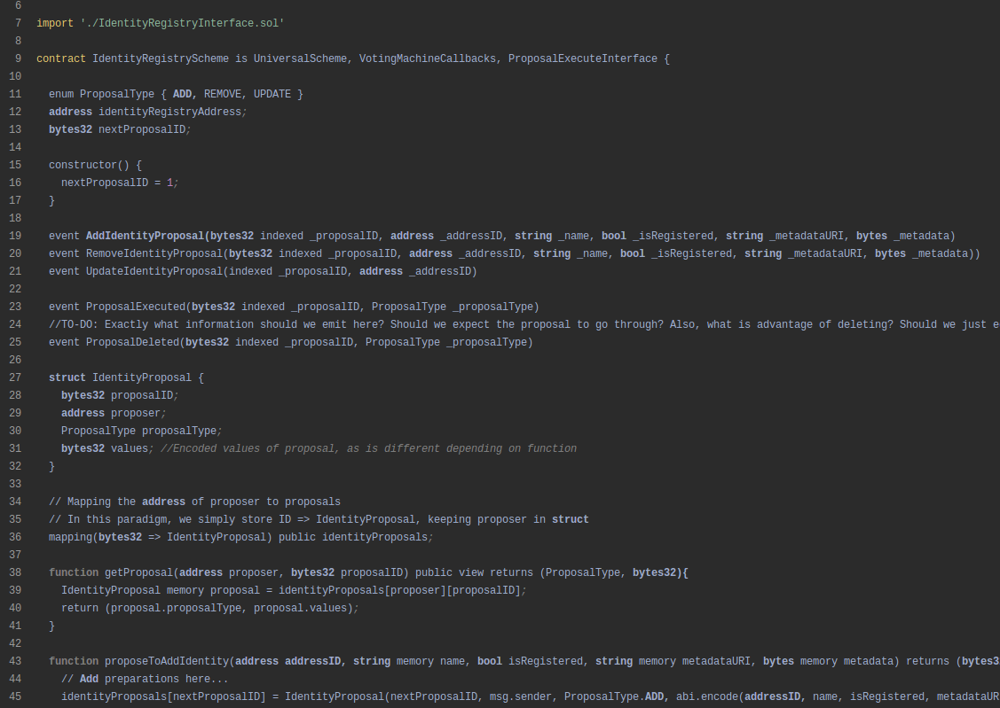
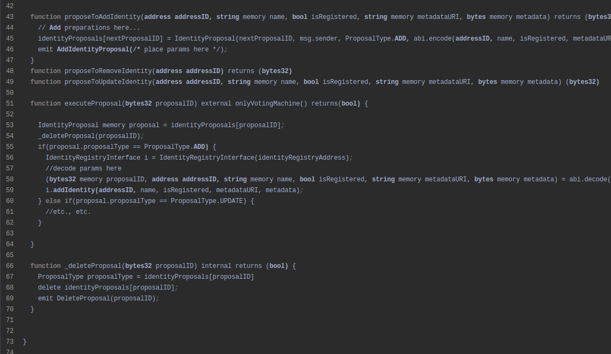

# IdentityDAO Technical Spec v0.3 (Markdown)

Created: Jul 11, 2019 10:13 PM
Edited: Jul 11, 2019 10:29 PM

# Identity DAO Technical Spec v0.3

## IdentityDAO Javascript Library

For development convenience, an Identity DAO Javascript library may be provided to help verify users. This library should work as a straightforward direct interface to any actions which can be performed via the DAO itself. Example of what using this library may look like:

    const IdentityDAO = require(‘identity-dao’);
    const identityDAO = new IdentityDAO(web3);
    IdentityDAO.isUnique(‘0xc1B1b64c33e0578DBa9E2CEacf0F8763128ddF63’); //returns a boolean
    IdentityDAO.proposeAdd(‘Vitalik Buterin’, ‘0x5E0318D57c2F0d1262df93478A92EeDAd246A374’,
    ‘QmYwAPJzv5CZsnA625s3Xf2nemtYgPpHdWEz79ojWnPbdG’); //sends an addProposal, using the
    defaultAccount from web3. Alternate constructor inputs can be used to modify this

Example of a potential Identity DAO UI: 

Note that the “Proposed by:” field is automatically filled based on the logged in user. This can work as additional visual confirmation on what the proposal will generate.

## Identity DAO Plugin Integration

Making registered identities easy for dApps to verify and use is the optimal way to ensure Identity DAO’s integration on various platforms. A simple script which developers can pop into the page and instantly get access to the ability to sign users may be a viable solution for this.

One potential userflow which works with Metamask may be: 

- Identity DAO Javascript plugin attempts to pull web3 from **window.web3**
- Display a visible widget encouraging the user to click if signing in with Identity DAO
- On click of the widget...
    - The plugin checks if Metamask has been loaded. If not, notify the user and request unlocking Metamask. If not installed, link to basic instructions on installing Metamask.
    - If Metamask has been loaded, request a signature (prompted by Metamask). On receipt of the transaction hash, display a “loading” icon. If some failure occurs, display it.

The dApp is responsible for listening for this confirmed signature and handling session logic (e.g. timeout).

## On-chain Architecture

The smart contract architecture for the Identity DAO project is fairly simple; the DAO Avatar keeps control over the **IdentityRegistryScheme** contract, which acts as an interface for any validated user to propose adding, removing, or updating, a registered Identity. All proposals are stored within a mapping in the contract, as proposalIDs => IdentityProposal structs. Because the add, remove, and update functions all have different values of parameters, the struct simply holds these parameters as a single ABI encoded value – bytes32.

On execution through the executeProposal() function, the contract will look up the proposal within the mapping, delete it (to prevent re-entrancy), and, based on the ProposalType enum value, destruct the values variable as expected.

The IdentityRegistryScheme contract, in turn, controls the **IdentityRegistry** itself. The IdentityRegistry contract can be seen as an isolated contract concerned only with the manipulation of the registry itself. In executing particular proposals, the Scheme contract will call the appropriate function on IdentityRegistry. These functions are restricted to the scheme contract, ensuring that DAO voting is required for using them.

The Identity struct provides a boolean flag for determining registration, and a metadata URI linking to a JSON on IPFS with further detail on the identity. This can range from identity-related descriptions and contact information, to Twitter handles and special tags.

The other two fields provide the opportunity to store a name and metadata directly onchain, but is tentative, as this can also be stored directly on IPFS. Weighing which data may be preferable to keep on-chain vs. off-chain solutions will likely define the rest of these fields.

The next few sections will provide an overview of this architecture, alongside sample psuedo-code in Solidity.

### Sample Code:

**IdentityRegistryInterface.sol**

**IdentityRegistry.sol**

**IdentityRegistryScheme.sol**

