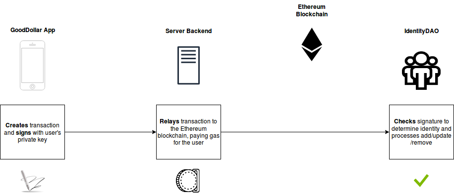

# Architecture
Below is a technical specification for the GoodDollar dApp, server, and ID-DAO. Please note that the **current version of the architecture is tentative**, and is subject to change at any moment.

## Overview


## Architecture

### GoodDollar App

All client-side operations happen here, in the GoodDollar UI. Mnemonic phrases and private keys should not be sent or exposed to servers. The GoodDollar app should be ready to:

- Handle initial seed generation
- Sign transactions

The seed generation can involve some user input to provide more randomness. web3.js will be used to handle transaction signing. Transactions for relaying are sent to the server.

### App Server Backend

The app server backend will handle all interactions with the Identity DAO, and in extension, the registry. **All private user information** and **authentication documents** should be held here, such as physical addresses, user ID photo records, public keys, and PIN hashes. 

**Transaction Relaying**



Every send transaction to the Ethereum blockchain requires gas, and managing an internal wallet to handle pushing them to the network. Any requests to add, update, or remove identities from a user is signed by the private key client-side, sent to the backend, and forwarded by paying gas costs.


This would be accomplished in the following way. Client-side, the GoodDollar App would run something like:
```javascript
const signedTx = await web3.eth.signTransaction({ from: "0xB279182D99E65703F0076E4812653aaB85FCA0f0",
    gasPrice: "20000000000",
    gas: "21000",
    to: "0xdA35deE8EDDeAA556e4c26268463e26FB91ff74f", //IdentityRegistryScheme contract
    value: "1000000000000000000",
    data: "0x8be65246 
    	  0000000000000000000000000000000000000000000000000000000000000123
   		  0000000000000000000000000000000000000000000000000000000000000080
   		  3132333435363738393000000000000000000000000000000000000000000000
   		  00000000000000000000000000000000000000000000000000000000000000e0
   		  0000000000000000000000000000000000000000000000000000000000000002
    		0000000000000000000000000000000000000000000000000000000000000456
    	  0000000000000000000000000000000000000000000000000000000000000789
    	  000000000000000000000000000000000000000000000000000000000000000d
   		  48656c6c6f2c20776f726c642100000000000000000000000000000000000000
      " //ABI-encoded function input data
});
    
console.log(signedTx);
    
/*
{
    raw: '0xf86c808504a817c8008252089435dA35deE8EDDeAA556e4c26268463e26FB91ff74f880de0b6b3a76400008025a04f4c17305743700648bc4f6cd3038ec6f6af0df73e31757007b7f59df7bee88da07e1941b264348e80c78c4027afc65a87b0a5e43e86742b8ca0823584c6788fd0',
    tx: {
        nonce: '0x0',
        gasPrice: '0x4a817c800',
        gas: '0x5208',
        to: '0xdA35deE8EDDeAA556e4c26268463e26FB91ff74f',
        value: '0xde0b6b3a7640000',
        input: '0x',
        v: '0x25',
        r: '0x4f4c17305743700648bc4f6cd3038ec6f6af0df73e31757007b7f59df7bee88d',
        s: '0x7e1941b264348e80c78c4027afc65a87b0a5e43e86742b8ca0823584c6788fd0',
        hash: '0xda3be87732110de6c1354c83770aae630ede9ac308d9f7b399ecfba23d923384'
      }
}
*/
```
This **signedTx** data is then passed onto the GoodDollar server, which sends it from an internal wallet like so:

    web3.eth.sendSignedTransaction(signedTx)
    	.on('error', () => { //error-handling code })
    	.on('receipt', () => { //success and clean-up })

**External Interactions**

The GoodDollar server should be able to handle calls to:

- 3rd-party ID verification services (e.g. Onfido, Shufti Pro)
- OAuth authorization APIs for verifying account ownership
- IPFS nodes for uploading and pinning data

**Identity Definition**

Identity proposals will contain a hash of an Identity Definition payload:

```JSON
{
  "name" : "Bob Hutchings",
  "address" : "0x1bc9e52baa93dab1a47c3168fd82ed08856ec83", 
  "media": {
    "selfie" : "ipfs://QmSrPmbaUKA3ZodhzPWZnpFgcPMFWF4QsxXbkWfEptTBJd",
    "video" : "ipfs://WeStGmTvKOZ3ZfdacKASnpFcsCFGGV1WxcCvnLzBmvVCNq",
  },
  "social" : {
    "Twitter" : "https://twitter.com/Hutchin_Bunchin/status/1110270197665951744",
    "LinkedIn" : "...",
    "Github" : "...",
  },
  "oracles" : [
    "GoodDollar",
    "Keybase",
  ]
}
```
**APIs**

Alongside an API for the front-end to call, the backend should expose an **Oracle API** for returning successful user verification. The API should return a basic JSON to be parsed by Alchemy and outside services. 

An example Oracle query might look like:
```JSON
Oracle:
"GoodDollar" => "https://verify.gooddollar.org/0x1bc9e52baa93dab1a47c3168fd82ed08856ec83"
returns:
{
  "facebook-oauth" : true,
  "google-oauth" : true,
  "gov-id-verified" : true
}
```

The returned value above confirms that the user with the address `0x1bc9e52baa93dab1a47c3168fd82ed08856ec83` has been **verified** from the GoodDollar server with Facebook and Google OAuth, and has passed an internal government ID check. This can give potential voters supporting ground in approving or refusing new identities. This information would likely be held in an internal user database.

### IPFS Nodes

**IPFS**, a decentralized storage provider, will be used to host selfies, videos, and any data that is too large to fit on-chain. These nodes should expose an API for uploading, retrieving, and pinning data. These nodes can either be self-managed (e.g. AWS S3) or use third-party node solutions (e.g. Temporal), which offload the resources for running and maintaining nodes internally. 

### IdentityDAO

The blockchain layer of this application is the Identity DAO, which will manage the human-checked approvals of identities. The server, and any external pieces, should interface with either Alchemy or web3.js to interact with this. For convenience, however, a simple Javascript library can give a simple interface to developers simply looking to work with the IdentityDAO's functions without the overhead of working with web3.js.

**Javascript Library**

For development convenience, an Identity DAO Javascript library may be provided to help verify users. This library should work as a straightforward direct interface to any actions which can be performed via the DAO itself. Example of what using this library may look like:

```javascript
const IdentityDAO = require(‘identity-dao’);
const identityDAO = new IdentityDAO(web3);
    
// Returns a boolean
IdentityDAO.isHuman(‘0xc1B1b64c33e0578DBa9E2CEacf0F8763128ddF63’);
    
// Sends an addProposal, using the defaultAccount from web3.
// Alternate constructor inputs can be used to modify this.
IdentityDAO.proposeAdd(
  ‘Vitalik Buterin’,
  ‘0x5E0318D57c2F0d1262df93478A92EeDAd246A374’,
  ‘QmYwAPJzv5CZsnA625s3Xf2nemtYgPpHdWEz79ojWnPbdG’
);
```

**On-chain Architecture**

The smart contract architecture for the Identity DAO project is fairly simple; the DAO Avatar is the owner of the **IdentityRegistry** contract, which acts as a source of truth for all verified identities. The **IdentityRegistry** contract exposes 3 functions for the owner to call: add(...), remove(...), and update(...).

In order for the Avatar to call these functions, a proposal must first be passed. This proposal will be created by the **GenericScheme** contract, a Universal Scheme that DAOs can use to invoke any function call on the blockchain.

Upon execution, the Avatar will call the **IdentityRegistry**'s method with the proposed arguments. For example, if a user named "Bob" is asking to be added to the registry, a call to the add(...) function will be made on the DAO's behalf with Bob's information as arguments.

The IdentityRegistry itself stores a mapping of the user's address to a hash of their Identity Definition described above. The next few sections will provide an overview of this architecture, alongside sample psuedo-code in Solidity.

### Contracts (WIP)

[**IdentityRegistry.sol**](../contracts/IdentityRegistry.sol): A registry that maps an address to an IPFS hash that contains the human's metadata.  

[**IRegistry.sol**](../contracts/IRegistry.sol): Registry interface.  

[**IVerifyHuman.sol**](../contracts/IVerifyHuman.sol): isHuman interface.  

## Examples

### Initial User Sign Up


