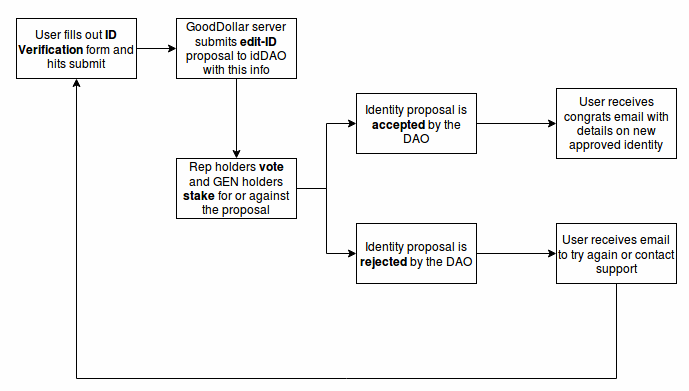

# Product

Below are product-focused high-level mock-ups and userflows for each scenario.

## Add I.D.

### GoodDollar User On-boarding


After the user goes through GoodDollar's login in / create account flow, they'll be asked to verify their identity. The user will be asked to provide a selfie, video, and social account verifications. These will all be verified by the DAO through a proposal accessible through alchemy.

*Example Proposal Payload:*
```json
{
  "name" : "Bob Hutchings",
  "address" : "0x1bc9e52baa93dab1a47c3168fd82ed08856ec83", 
  "media": {
    "selfie" : "ipfs://QmSrPmbaUKA3ZodhzPWZnpFgcPMFWF4QsxXbkWfEptTBJd",
    "video" : "ipfs://WeStGmTvKOZ3ZfdacKASnpFcsCFGGV1WxcCvnLzBmvVCNq",
  },
  "social" : {
    "Twitter" : "https://twitter.com/Hutchin_Bunchin/status/1110270197665951744",
    "LinkedIn" : "...",
    "Github" : "...",
  },
  "oracles" : [
    "GoodDollar",
    "Keybase",
  ]
}
```

*Example Oracle Query:*
```json
Oracle:
"GoodDollar" => "https://verify.gooddollar.org/0x1bc9e52baa93dab1a47c3168fd82ed08856ec83"
returns:
{
  "facebook-oauth" : true,
  "google-oauth" : true,
  "gov-id-verified" : true
}
```

### Alchemy Add I.D. Verification


In Alchemy, the proposal payload that was prepared in the GoodDollar app is shown in the UI. Any verifications from GoodDollar's oracle are queried by Alchemy and shown. Two primary use cases for this oracle are government ID verification and external account OAuths. With this information, human voters can check these to determine whether the proposal is real. 

### Scenario Flowchart

Before the first time the user claims GD tokens, they are prompted to prove their identity.


## Edit I.D.

### GoodDollar User Profile Update


### Alchemy Edit I.D. Verification


On Alchemy, any changes or edits to a pre-existing identity will be reflected by the UI. Anything that has stayed the same will be omitted.

### Scenario Flowchart

Every 2 years, the user is prompted to re-prove their identity.



## Delete I.D.

### GoodDollar User Off-boarding


Deleting an identity from the GoodDollar app is fairly straightforward. Within the GoodDollar app's menu bar, the user would simply tap "Delete Account", and confirm the deletion. Finally, the GoodDollar server relays the signed transaction to remove the account to the network, and an email is sent to the user on success.

### Scenario Flowchart

At any time, the user can remove their own account from the registry.


## GoodDollar Alchemy User On-boarding
After having their identity approved, the user will be invited via email to participate in the IdentityDAO as a voter.


## Miscellaneous Scenarios

### User Forgot PIN


### Contact Support


### DAO Removes GoodDollar User's Identity


